# Evaluation Web App

The core of ELEVANT is a web app that lets you analyse and compare the results of various linking systems over various
 benchmarks. This document contains instructions for starting the web app and gives an overview over the web app's
 features.

## Start the Web App

Steps 1 - 4 are executed automatically when running `make start_webapp`. 
1. Go to (this) directory

       cd evaluation-webapp

2. Link to the results directory `evaluation-results`. This is the directory containing subfolders with
`*.linked_articles.jsonl`, `*.eval_cases.jsonl` and `*.eval_results.json` files.

       ln -s ../evaluation-results

3. Link to the benchmark directory that contains various benchmarks in jsonl format

       ln -s ../benchmarks

4. Link to the whitelist type file that contains a mapping from whitelist type QIDs to their label

       ln -s ../small-data-files/whitelist_types.tsv

5. Start a file server

       python3 -m http.server [PORT]

6. Access the web app at `0.0.0.0:[PORT]` (default port is 8000).

## Features
We designed the ELEVANT web app to be intuitive and self-explanatory. Nevertheless, this section gives an overview of
 the features of the web app.

### The Evaluation Results Section

#### The Evaluation Results Table

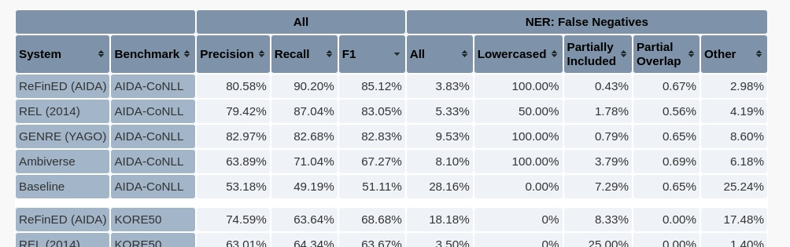

The center piece of the evaluation results section is the evaluation results table. The other components in the
 evaluation results section give you control over what exactly is shown in this table.
 The table shows precision, recall and F1 scores for all systems over all benchmarks, as well as error rates for
 fine-grained error categories, with one row per system. When clicking on a table cell, the individual predictions of
 the corresponding system are shown over the benchmark text with ground truth labels. These linking
 results are displayed below the evaluation results table in the linking results section. The mentions that count
 towards the result displayed in the selected cell or cells (precision, recall and F1 columns can only be selected
 collectively) are highlighted in the linking results table. That is, when clicking on a cell in the "All" column,
 all entity mentions are highlighted. When clicking on a cell in the column "Lowercased" under "NER: False Negatives",
 only undetected ground truth mentions that start with a lowercase letter are highlighted.
 When clicking a cell in the "System", "Benchmark" or the "NER" column, all entity mentions are highlighted.

The **system name** displayed in the **System** column corresponds to the `experiment_name` specified in the
 `.metadata.json` file of the corresponding experiment or, if no `.metadata.json` file exists, to the 
 `<experiment_name>` part of the file name (with file names in the format
 `evaluation-results/<linker_name>/<experiment_name>.<benchmark_name>.linked_articles.jsonl`).

Similarly, the **benchmark name** displayed in the **Benchmark** column corresponds to the `name` specified in the
 `.metadata.json` file of the corresponding benchmark or, if no `metadata.json` file exists to the `<benchmark_name>`
 part of the file name.

Hover over the error category column headers for information on how the results in that column are being computed.

You can **delete an experiment** from the evaluation results table by deleting (or moving) all files that correspond
 to this experiment, i.e. in the `evaluation-results/<linker_name>/` directory all the files that start
 with `<experiment_name>.<benchmark_name>.*`. It should be four files: The `.linked_articles.jsonl` file, the
 `.metadata.json` file, the `.eval_cases.jsonl` file and the `.eval_results.jsonl` file.
In order to see the changes, you need to reload the web app (possibly disabling caching).

#### Evaluation Mode

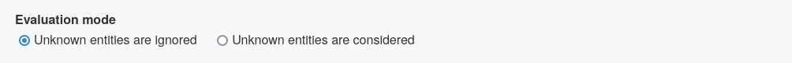

Here you can specify whether unknown entities (also referred to as NIL entities) should just be ignored for the
 evaluation (this is equivalent to GERBIL's "inKB" mode) or whether they should be considered (equivalent to GERBIL's
 "normal" mode).
In the former case, both unknown entities in the ground truth, as well as NIL predictions by a linker are simply
 ignored for the evaluation.
In the latter case, an unknown entity in the ground truth for example must be linked to NIL by the
 linker, otherwise it counts as a False Negative (and a False Positive if the linker linked it to something else). A
 NIL prediction by a linker counts as a False Positive if it does not correspond to a NIL ground truth mention (and a
 False Negative if it corresponds to a non-NIL ground truth mention).

#### Result Categories

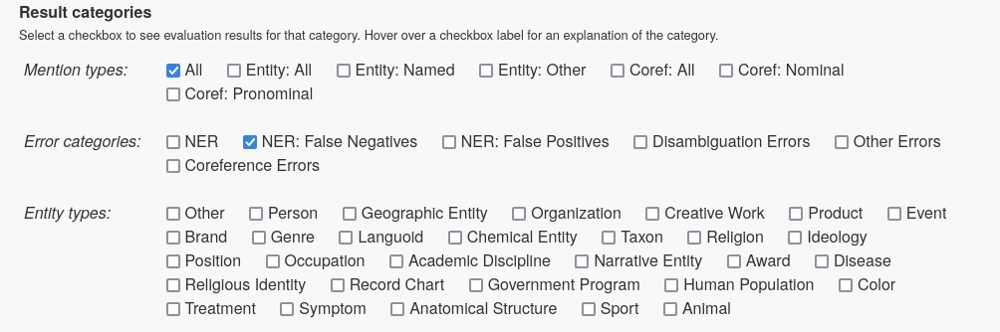

The result category checkboxes let you control which columns are shown in the evaluation results table. Each checkbox
 corresponds to a (set of) columns in the evaluation results table.
You can show results for different mention types, fine-grained error categories or per entity type.

#### Group Table Rows

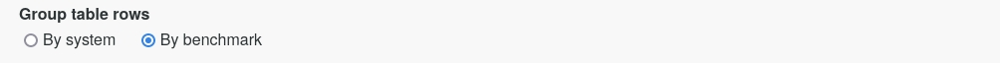

This lets you control whether the rows in the evaluation results table are grouped by system or by benchmark.

#### Filter Table Rows

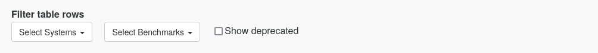

In the **Select Systems** dropdown menu, you can select the names of those systems for which you want to show results
 in the evaluation results table. You can do that by manually checking or unchecking systems, or by entering a
 regular expression in the filter text field. In the latter case, all the systems that match the regex (case
 insensitive) will be checked and displayed in the evaluation results table.
In order for a system to appear in the dropdown menu, the system needs to have been run and evaluated over at least
 one benchmark.

Similarly, in the **Select Benchmarks** dropdown menu, you can select the names of those benchmarks for which you
 want to show results in the evaluation results table. In order for a benchmark to appear in the dropdown menu, at
 least one linker needs to have been evaluated over this benchmark.

With the **Show deprecated** checkbox, you can show or hide experiments that contain the word *deprecated* in their
 name. This is useful if you have results that you don't really need anymore but you also can't get yourself to
 delete them just yet...

#### Copy Table

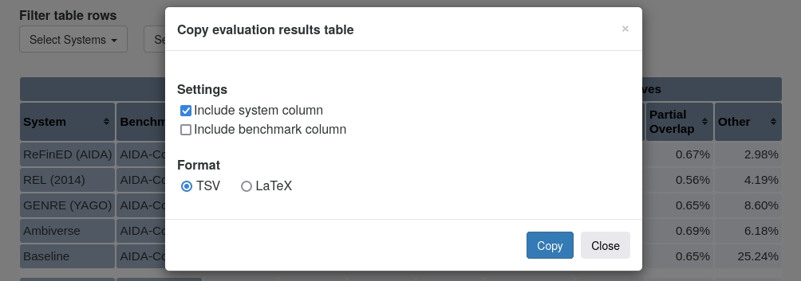

When you click on the **Copy table** button, you can copy the currently displayed table either as TSV or as LaTeX.

#### Create Graph From Table

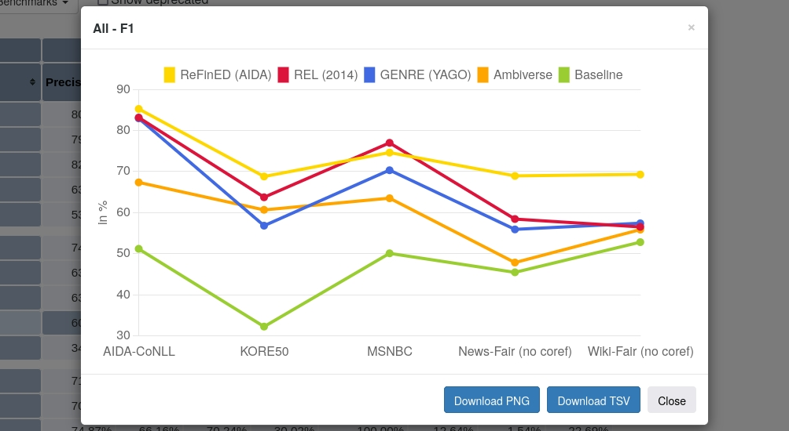

When you click on the **Create graph from table** button, you can select a table column for which a multi-line-graph
 will then automatically be generated. The benchmarks currently displayed in the table are given on the x-axis, the
 values of the selected column on the y-axis and a line is plotted for each system currently displayed in the table.
You can download the generated graph as PNG or as corresponding TSV file.

### The Linking Results Section

#### The Linking Results Table
The linking results table is the center piece of the linking results section.

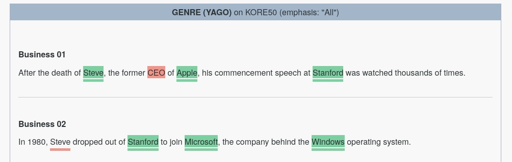

When a row in the evaluation results table is selected, the predictions from the corresponding system are shown in
 the linking results table over the benchmark text with the ground truth mentions from the corresponding benchmark.
 A text background highlight corresponds to a linker prediction and a text underline corresponds to a ground truth
 mention). For more information on the annotations and the color code, check the *annotation explanations* by
 hovering over the annotation explanation field in the web app.

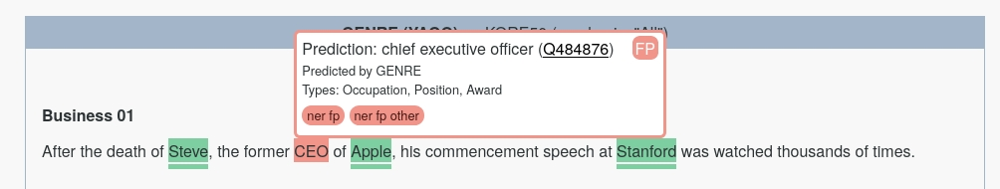

When hovering over an annotation in the linking results table, **tooltips** are shown for the predicted entity (or the
 ground truth mention or both). The tooltip shows the Wikidata label, the Wikidata QID (with a hyperlink to the
 corresponding entity in Wikidata), which linker predicted the entity (for prediction tooltips only), the entity type
 and a set of error categories the corresponding evaluation case falls into.
 
**You can jump between highlighted mentions using `Ctrl` + `right/left arrow key` on your keyboard.**

#### Compare Two Systems

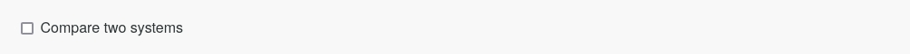

The **Compare two systems** checkbox lets you select two rows in the evaluation result table at the same time and
 compare their linking results side by side in the linking results table. Selected experiments must be over the same
 benchmark.
 
#### Select Article

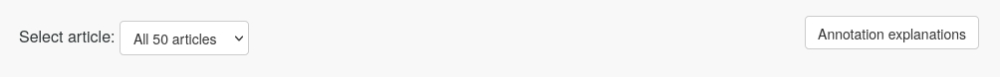

The **Select article** dropdown menu lets you select the benchmark article for which you want to inspect the linking
 results. Per default, all articles are shown at once. For benchmarks which include entire articles where only parts
 were annotated (i.e., the Wiki-Fair and News-Fair benchmarks and their variants), the entire article text (including
 non-annotated paragraphs) is only shown if a single article is selected. When all articles are selected, only the
 annotated and evaluated paragraphs are displayed.

#### Annotation explanations

The **Annotation explanations** field when hovered shows explanations for the color coding in the linking results table.

#### Show all / errors / avoided errors

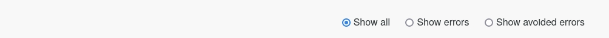

These radiobuttons give you more control of which mentions are highlighted (in addition to selecting error category
 cells in the evaluation results table): **Show all**: Highlight all mentions that fall into the selected category.
 **Show errors**: Highlight only those mentions that count as errors in the selected category. **Show avoided errors**:
 Highlight only those mentions that count as avoided errors in the selected category.
