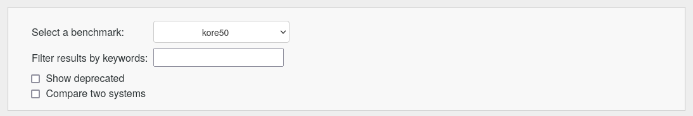
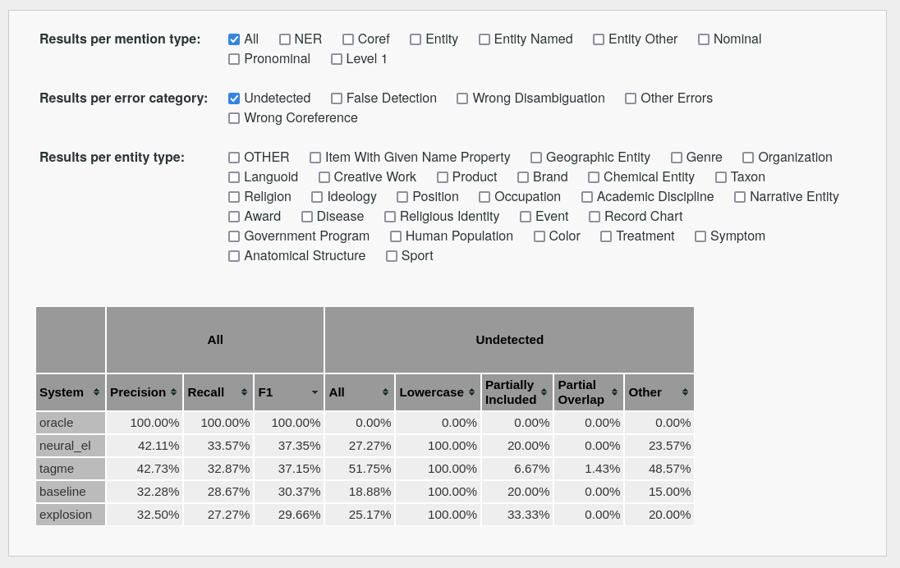
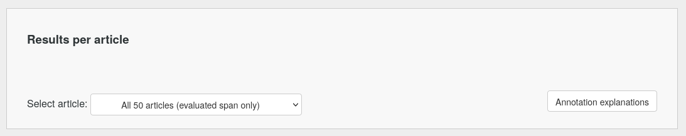
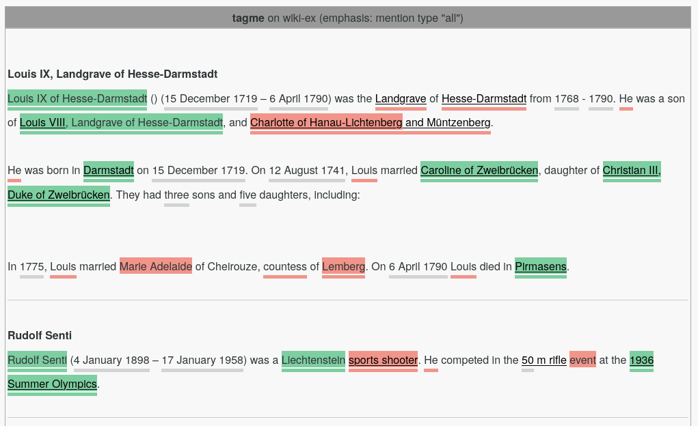
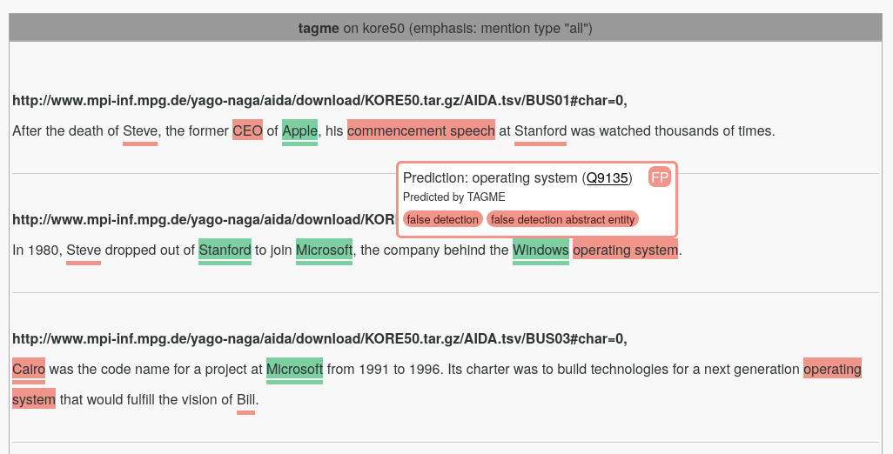

# Evaluation Web App

The core of ELEVANT is a web app that lets you analyse and compare the results of various linking systems over various
 benchmarks. This document contains instructions for starting the web app and gives an overview over the web app's
 features.

## Start the Web App

Steps 1 - 4 are executed automatically when running `make start_webapp`. 
1. Go to (this) directory

       cd evaluation-webapp

2. Link to the results directory `evaluation-results`. This is the directory containing subfolders with
`<approach>.cases` files.

       ln -s ../evaluation-results

3. Link to the benchmark directory that contains various benchmarks in jsonl format

       ln -s ../benchmarks

4. Start a file server

       python3 -m http.server [PORT]

5. Access the web app at `0.0.0.0:[PORT]` (default port is 8000).

## Features
We designed the ELEVANT web app to be intuitive and self-explanatory. Nevertheless, this section gives an overview of
 the features of the web app.

### The Benchmark Box

The **benchmark selector** lets you select a benchmark from a dropdown menu. The dropdown menu has an entry
 `<benchmark_name>` for each benchmark file in the correct format at
 `benchmarks/<benchmark_name>.benchmark.jsonl`.

The **results filter** lets you enter a regular expression which is applied over the first column of the evaluation
 results table to filter out table rows that don't match the regular expression. The regular expression is split at
 whitespaces and linked by an "AND" function. For example, entering the string "entity uppercase" will keep all systems
 in the evaluation results table that match both "entity" and "uppercase", such as "my_entity_linker.only_uppercase".

The **show deprecated checkbox** when checked shows rows in the evaluation result table where the first column contains
 the text "deprecated". Such rows are filtered out when the checkbox is unchecked.

The **compare two systems checkbox** lets you select two rows in the evaluation result table at the same time and
 compare their linking results side by side in the linking results table.

### The Evaluation Results Box

The **results checkboxes** control which columns are shown in the evaluation results table. There are three types of
 columns. *Mention type* columns, *error category* columns and *entity type* columns. 

The **evaluation results table** shows precision, recall and f1 scores for the selected benchmark, as well as error
 category counts and percentages, with one row per system. When clicking on a table cell, the linking results for the
 corresponding system are shown in the linking results table. The mentions that count into the result displayed in the
 selected cell or cells (precision, recall and f1 columns can only be selected collectively) are highlighted in the
 linking results table. That is, when clicking on a cell in the "All" column, all entity mentions are highlighted. When
 clicking on a cell in the column "Lowercase" under "Undetected", only undetected ground truth mentions that start with
 a lowercase letter are highlighted. *You can jump to the next/previous highlighted mention by using the right/left
 arrow keys on your keyboard*. Using Ctrl + right/left arrow key, you can jump to the next/previous highlighted mention
 that is an error. When clicking a cell in the "System" or the "NER" column, all entity mentions are highlighted.
 Therefore, the corresponding cell in the "All" column is highlighted in that case.

Hover over the error category column headers for information on how the results in that column are being computed.

### The Linking Results Box

The **article selector** lets you select the benchmark article for which you want to inspect the linking results. Per
 default, all articles are shown at once.

The **annotation explanations field** when hovered shows explanations for the annotation syntax in the linking
 results table.

#### The Linking Results Table

When a row in the evaluation results table is selected, the linking results for the corresponding system and the
 selected benchmark are shown in the linking results table, together with the ground truth labels (highlighted text
 corresponds to linking results, underlined text correspond to ground truth labels). For more information on the
 annotations and the color code, check the *annotation explanations* by hovering over the annotation explanation
 field in the web app.

When hovering over an annotation in the linking results table, **tooltips** are shown for the predicted entity (or the
 ground truth label or both). The tooltip shows the Wikidata label, the Wikidata QID (with a hyperlink to the
 corresponding entity in Wikidata), which linker predicted the entity (for prediction tooltips only) and a set of error
 categories the corresponding evaluation case falls into.
